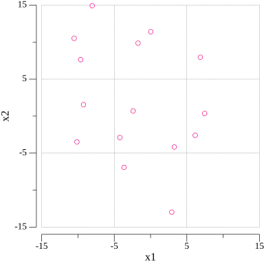

# gode
Simple implementation of Diffirential Evolution, DE in golang



## Usage

In `main.go`, set parameters here:

```go
// Parameters
const (
	F         float64 = 0.5   // Scaling factor
	N         int     = 10    // Number of agents
	CR        float64 = 0.5   // Crossover rate
	Dimension int     = 2     // Dimension of the data
	IterMax   int     = 100   // Number of iterations
	Logging   bool    = false // If true, print data of each iteration
	Plotting  bool    = true  // If true, plot the trajectory to png and gif files
)

var (
	Xmin = [Dimension]float64{-15.0, -15.0} // Minimum value of each dimension
	Xmax = [Dimension]float64{15.0, 15.0}   // Maximum value of each dimention
)
```

and write your target function here:

```go
// Target function to be minimized
func target(xi []float64) float64 {
	return xi[0]*xi[0] + xi[0]*xi[1] + xi[1]*xi[1] - 5*xi[0] - 5*xi[1] + 25
}
```

then run by:

```bash
$ go run main.go plot.go
```

## Plot

If the dimension of the target function is 2 and the parameter `Plotting` is set to `true`, it output the trajectory of optimization to multiple PNG files in `traj` directory and a GIF animation as `traj.gif`.

This plotting process is implemented using:
- gonum.org/v1/plot (*Copyright ©2013 The Gonum Authors. All rights reserved.*)